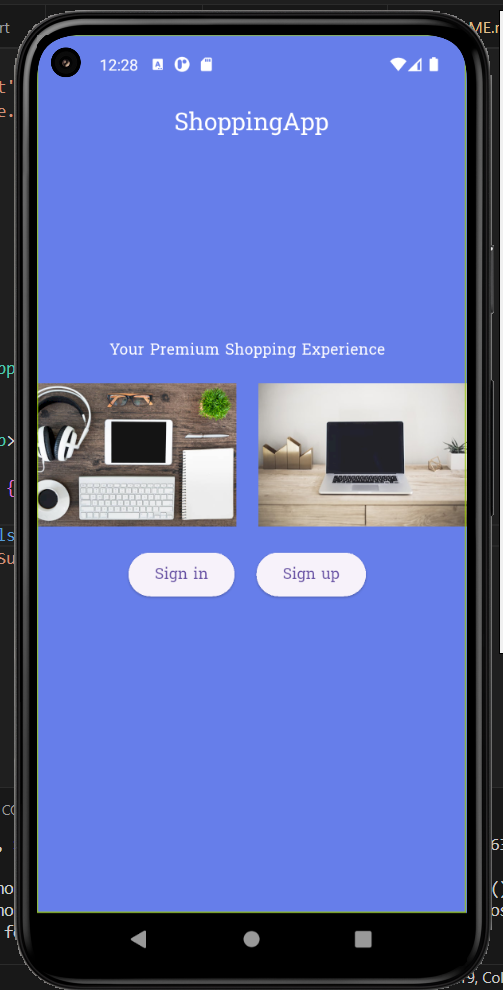
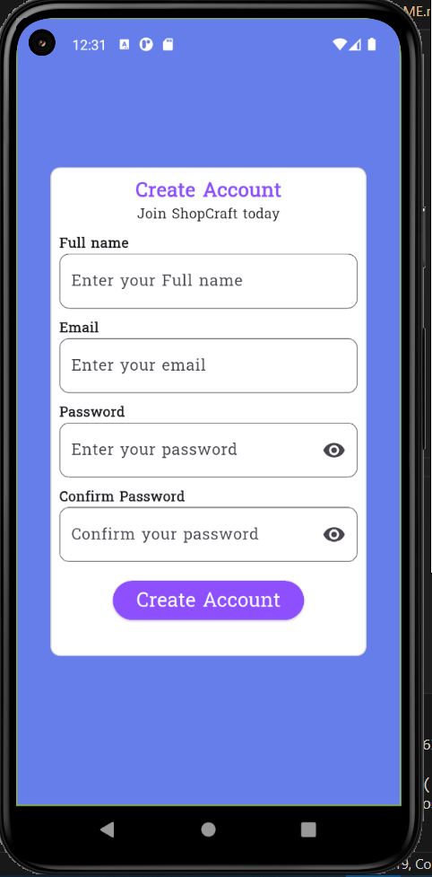
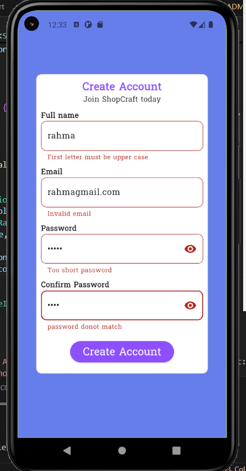
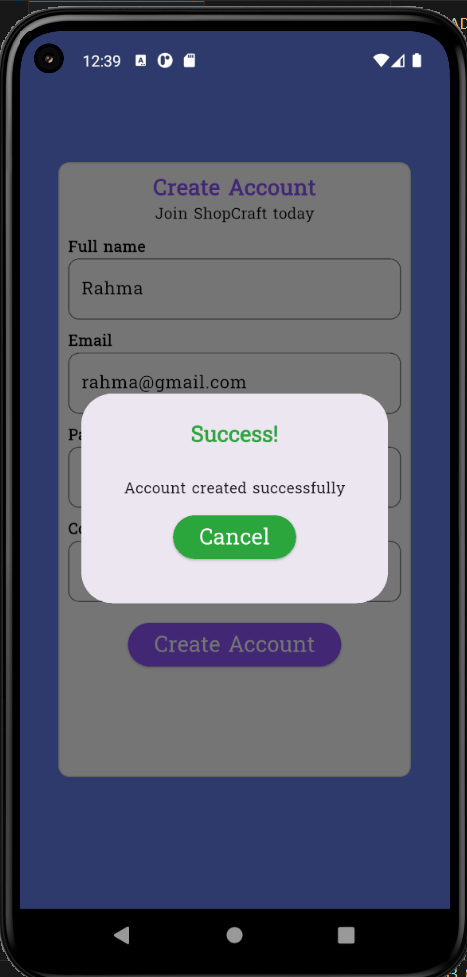
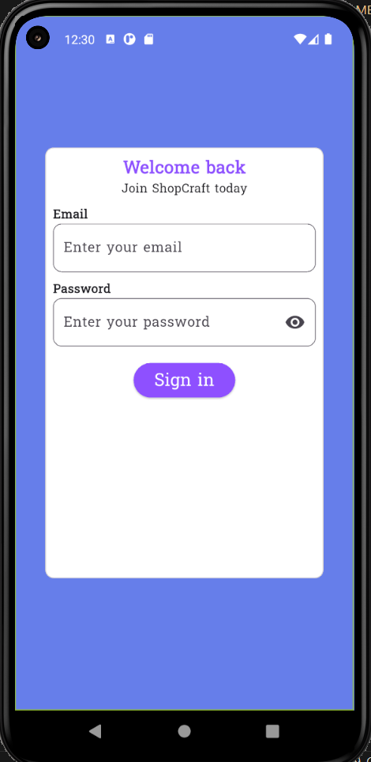
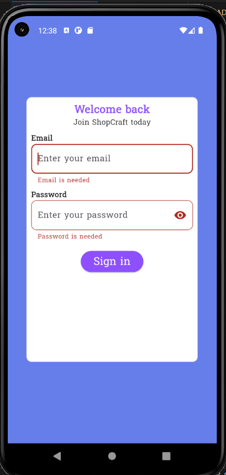
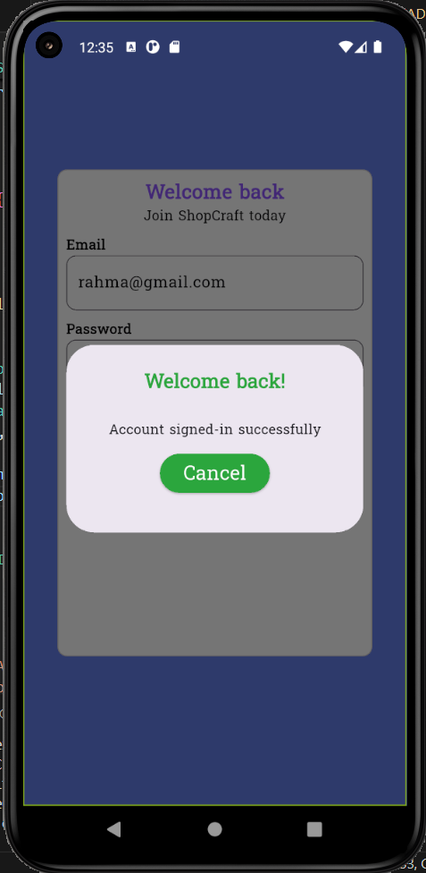
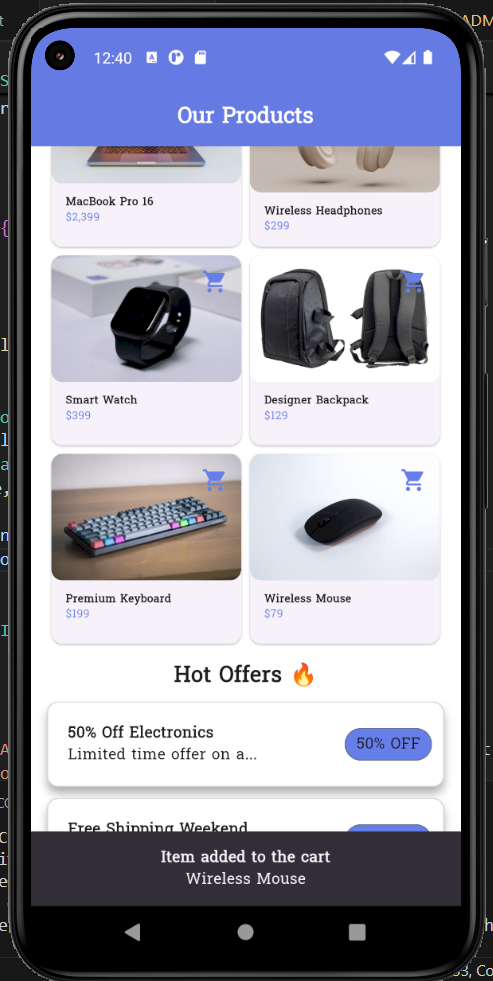

# ShoppingApp

## Project Overview
This project is an **e-commerce application built with Flutter**.  
It allows users to browse products and perform login/registration.  

---

## Features
- sign-in and sign-up feature
- Home page displaying products   
- Simple and attractive user interface   

---

## Setup Instructions
1. Make sure [Flutter](https://flutter.dev/docs/get-started/install) is installed on your machine.  
2. Clone the project from GitHub:  
   ```bash
   git clone https://github.com/RahmaElhagary/shoppingApp.git

   ```

---

## Screenshots

### Main Page


### Sign-up Page



### Sign-up Validation



### Signed-up successfully



### Sign-in Page


### Sign-in Validation



### Signed-up successfully



### Home Page


### Add item to the cart



